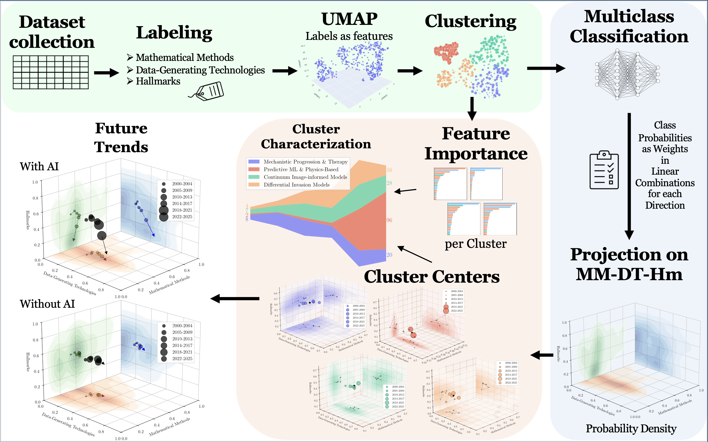

## Brain Cancer *In-Silico* Modeling Survey Repository

This repository contains the code, dataset, environment files, and analysis notebook used in the study:

> **Brain cancer in *silico* modeling – The roadmap ahead**  
> *Journal of Theoretical Biology (2026)*

The work provides a comprehensive survey and computational exploration of mathematical and data-driven models in brain cancer research, by performing a comprehensive meta-analysis of brain cancer research articles (2000–2025) using an optimal clustering methodology and a novel 3D projection space. The analysis categorizes the literature into four distinct clusters and traces their evolution across three primary axes: Mathematical Methods (MM), Data-Generating Technologies (DT), and Hallmarks (Hm).

---
## 📂 Repository Structure
| File/Folder                   | Description                                                                                                               |
| ----------------------------- | ------------------------------------------------------------------------------------------------------------------------- |
| README.md                     | Project documentation and usage guide.                                                                                    |
| `Methodology/Methodology.png` | Graphical workflow: dataset curation, UMAP projection, clustering, feature-importance analysis, MM-DT-Hm projection.      |
| Brain_Cancer_Survey.ipynb     | Main Jupyter notebook implementing the literature analysis, clustering, and visualization pipeline.                       |
| cancer_dataset_module.py      | Python module providing utility functions for dataset processing and analysis.                                            |
| datasets/                     | Directory containing the primary bibliographic data (Main_Dataset_clustered.csv) and any intermediate generated datasets. |
| figures/                      | Contains all graphical outputs, including cluster feature importances and 3D probability density plots.                   |
| environment.yml               | Conda environment file for replicating the research software environment.                                                 |
| requirements.txt              | Pip-based dependency list for manual environment setup.                                                                   |

---

## 🔬 Methodology Overview


<p align="center">
  <br>
  <em>Methodology Overview.</em>
</p>

This repository implements the computational pipeline described in the manuscript:
### ✅ Key Components 
- Annotate studies along **Mathematical Methods (MM)**, **Data Technologies (DT)**, and **Hallmarks (Hm)**.
- Dimensional reduction via **UMAP**
- **Unsupervised clustering**
- Random Forest–based **feature importance**
- **Multiclass Classification**
- Projection into **MM–DT–Hm** space to track **mathematical complexity**, **experimental data integration**, and **biological depth** over time

---

## 📦 IInstallation & Environment Setup
#### 1. **Clone the repository**
   ```bash
   cd your-repo-directory
   git clone https://github.com/InSilicoModellingGroup/survey_of_brain_cancer_in_silico_models.git
   ```

To ensure reproducibility, all required libraries are listed in both `requirements.txt` and `environment.yml`. You can use either pip or conda for installation.

#### 2. **Create and activate a virtual environment** (recommended)

   ✅ Option A: Using `environment.yml` (with conda). No need to install dependencies separately.

   ```bash
   conda env create -f environment.yml
   conda activate brain_cancer_analysis_env
   ```

   ✅ Option B: Using python directly

   ```bash
   python3 -m venv venv
   source venv/bin/activate
   ```

#### 3. **Install dependencies**
   ```bash
   pip install --upgrade pip
   pip install -r requirements.txt
   ```
---

## **📚 Required Libraries**

Key packages (exact versions in `requirements.txt`):

- numpy==1.26.4
- pandas==2.2.3
- scipy==1.15.2
- scikit-learn==1.6.1
- umap-learn==0.5.11
- numba==0.64.0
- matplotlib==3.10.1
- seaborn==0.13.2
- plotly==6.5.0
- kaleido==1.2.0
- mpld3==0.5.12
---

## 🖥️ Usage

### Run the main analysis notebook 
```bash
jupyter notebook Brain_Cancer_Survey.ipynb
```
---

## 📊 Outputs

The notebook produces:

- Histograms and other statistical figures
- UMAP projections of annotated works
- 4 emergent research clusters:
   1. Mechanistic models in disease progression and therapy. 
   2. Predictive ML and physics-based models.  
   3. Continuum image-informed models.  
   4. Differential brain cancer invasion models.
- Feature importances per cluster
- Interactive 3D MM–DT–Hm projections
- Probability Densities
- Temporal trends in modeling strategies
- MM–DT–Hm landscape evolution plots
---

## 📄 Notes
Generated figures are saved in the `/figures` directory.
Dataset related changes are saved in the `/dataset` directory.

---

## ✏️ Citation

If you use this code or dataset, please cite the corresponding paper::

> *"Brain cancer in silico modeling – The roadmap ahead"*, C.P. Papanikas, E. Tzamali, D.M. Manias, E. Ioannou, V. Vavourakis, D. Flouri, S. Soltani, V. Sakkalis, H. Hatzikirou and V. Vavourakis, **Journal of Theoretical Biology**, 2026.
---

## 📬 Contact

For questions or issues, please contact:

- **Dimitris M. Manias** ([dimitris.manias@ku.ac.ae](mailto:dimitris.manias@ku.ac.ae))
- **Vasileios Vavourakis** ([vavourakis.vasileios@ucy.ac.cy](mailto:vavourakis.vasileios@ucy.ac.cy))
---
